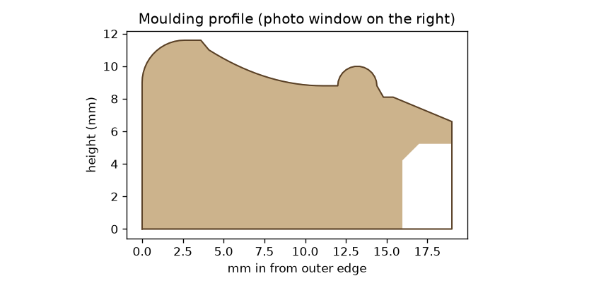

# Frame

A classic moulded photo frame, 120 × 120 mm, made for the Bambu P1S. `frame.py` generates every part using manifold3d and shapely. `preview.py` renders the images in `preview/`.




The moulding is 19 mm wide and 11.6 mm tall. Working inward from the outer edge it has a rounded outer bead, a sweeping cove, a fine inner bead and a bevelled sight edge around the photo. The corners are mitred.

## Parts (`stl/`)

| File | What | Print orientation |
|---|---|---|
| `frame.stl` | the frame | back face down, as exported |
| `back_plate.stl` | snap-in back | as exported (catches print on the bed side) |
| `stand.stl` | smooth desk stand that leans the frame back 12° | as exported |

None of the parts need supports. Every surface of the moulding faces upward. Under the lip above the photo pocket, a 45° taper keeps the overhang to 2 mm, and the photo hides it anyway.

## Photo

- Visible window: 82 × 82 mm.
- Cut the photo to **87 × 87 mm**.
- The pocket has 2.2 mm of room in front of the back plate. Fill it with the photo plus a 1 mm clear sheet or a piece of card.
- The back plate snaps in with two flexing catches on its edges. To remove it, pry at the notch on the bottom edge.

## Hanging

A keyhole in the back of the top border takes a screw with a head up to 7 mm and a shank up to 3.6 mm.

## Suggested settings

- Layers: 0.12–0.16 mm, so the cove and beads come out smooth.
- 3 walls, 15% infill.
- Filament: a wood-fill PLA, or a matte or silk PLA, looks great with this profile.

## Regenerate

```
pip install manifold3d shapely numpy matplotlib
python frame.py && python preview.py
```

## Web interface

`web/` holds a browser version of the generator: pick a photo or outer size, preview it in 3D and download a ZIP of STLs. It's published as an artifact at https://claude.ai/artifact/RCTT4QFAspR1fjSfJS8wiC.

- `frame-geom.js` is the JS port of `frame.py`. It runs on manifold-3d's WASM build.
- `template.html` is the page.
- `build.py` inlines the manifold glue, the WASM binary and the geometry file into `photo-frame-maker.html`.
- `test.mjs` builds three sizes in Node as a check.

```
cd web && npm install && python3 build.py && node test.mjs
```
