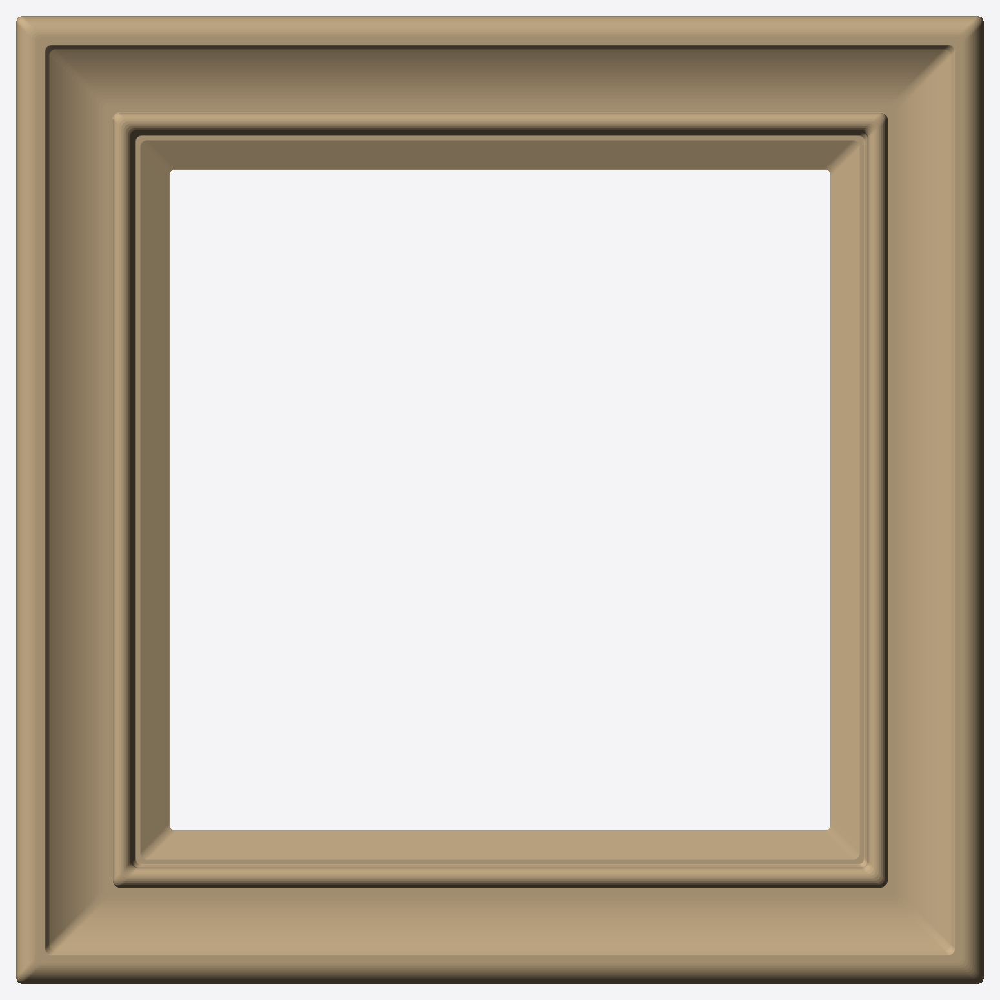
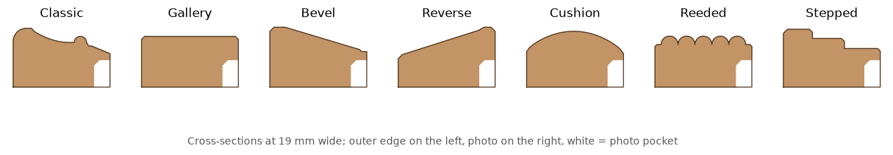

# Photo Frame Maker

Parametric, moulded photo frames for 3D printing on a Bambu P1S. Pick a photo size (or a finished frame size) and a moulding style, then download print-ready STLs for three parts: the frame, a snap-in back plate and a desk stand.

**Use it in the browser:** https://claude.ai/artifact/RCTT4QFAspR1fjSfJS8wiC



## What's here

| Path | What it is |
|---|---|
| `web/` | The browser generator, which is the main tool. Source for the page linked above. |
| `frame.py` | The original Python generator. It makes the fixed 120 × 120 mm Classic frame. |
| `stl/` | Ready-made STLs from `frame.py`: `frame.stl`, `back_plate.stl` and `stand.stl`. |
| `preview.py`, `preview/` | Top-down renders, the Classic cross-section and the style sheet below. |

## Moulding styles



| Style | Look | Depth |
|---|---|---|
| Classic | Rounded outer bead, sweeping cove, fine inner bead | 11.6 mm |
| Gallery | Flat, deep face with crisp chamfers | 10 mm |
| Bevel | Thick at the outside, slopes down to the photo | 11.8 mm |
| Reverse | Thin at the outer edge, rises toward the photo | 11.8 mm |
| Cushion | One soft rounded dome across the width | 11 mm |
| Reeded | Flat face with half-round reeds; wider mouldings get more reeds | 10 mm |
| Stepped | Three terraces stepping down to the photo | 11.4 mm |

Every style stretches to the moulding width you choose, from 12 to 40 mm. All corners are mitred.

## Using the web generator

1. **Size the frame.** Choose *Photo size* or *Outer frame size*, then enter width × height in mm as the frame will hang. There are presets for 4×6 in, 5×7 in, 3.5×5 in, Instax Mini, Instax Square, Polaroid and a 120 mm square.
2. **Choose the moulding.** Pick a style and a width.
3. **Fit details** (optional):
   - *Photo overlap* is how much of each photo edge the moulding covers. The default is 2.5 mm.
   - *Room for photo + glazing* is how much fits in front of the back plate. The default is 2.2 mm.
4. **Choose the parts:** frame, back plate, stand and keyhole. Untick *Frame* to get only a replacement back plate or stand.
   - *Back plate snap* (Looser / Standard / Tighter) adjusts how hard the back plate grips.
5. **Check the preview:**
   - The 3D view lets you drag to turn and scroll to zoom. Tabs switch between the frame front, frame back, back plate and stand.
   - Readouts show the outer size, the visible window, the photo cut size (mm and inches), the frame depth, a rough PLA weight, and whether each part fits the P1S bed.
6. **Download.** You get a ZIP with the STLs and a README.txt that records the photo cut size and print notes. Downloads are ZIPs because the page can't save `.stl` files directly.

The page refuses settings that can't be printed well:
- A window under 20 mm.
- A pocket so deep that the lip over the photo would be thinner than 1.2 mm. The message tells you the deepest pocket that works.
- A keyhole where the frame is too thin or too narrow behind it. The keyhole is left off and the page says so.

## Design details

- **Photo pocket:** cut from the back, 1 mm larger than the photo. It has a 45° taper under the lip, so the overhang is only about 2 mm and needs no supports.
- **Back plate:** 2 mm thick. Slits along its left and right edges turn them into flexible beams, each about 2 mm wide. Each beam carries a catch that clicks into a groove in the pocket wall.
  - The catch reaches 0.75 mm past the pocket wall. Its gripping edge is 0.4 mm tall, and above that is a ramp that guides it in.
  - The groove in the frame is 0.9 mm deep and runs from z 0.9 to 2.3. It's unchanged from the first version, so new plates fit frames that were already printed.
  - The plate prints inner-face-down so the ramps need no support.
  - *Back plate snap* in the web generator sets how far the catches reach past the pocket wall: Looser 0.55 mm, Standard 0.75 mm, Tighter 0.9 mm.
  - To print only a replacement plate, untick *Frame* and use the same size, moulding width and photo overlap as the frame.
  - To remove the plate, pry at the notch in the bottom edge.
- **Keyhole:** centred in the top border, for a screw with a head up to 7 mm and a shank up to 3.6 mm.
- **Stand:** a smooth, pebble-shaped base whose slot leans the frame back 12°. The slot width follows the depth of the chosen style.

## Printing

- Print the frame **back face down**, and the back plate and stand as exported. No supports.
- Use 0.12–0.16 mm layers so curves and beads come out smooth. 3 walls, 15% infill.
- Wood-fill, matte or silk PLA all suit the mouldings.
- **Print history:**
  - The first print (2026-10-05) showed the original snap was far too weak. Its catches only reached 0.4 mm past the wall, and the back plate barely held.
  - Only the plate was redesigned, as described under *Back plate* above; the frame is unchanged. The new plate hasn't been printed yet.
  - If the plate is too hard to press in, or still loose, change *Back plate snap* in the web generator.
  - The stand slot (0.6 mm slack) is also unprinted.

## Development

**Browser generator**

```
cd web
npm install            # manifold-3d 3.2.1
python3 build.py       # writes photo-frame-maker.html, about 740 KB, fully self-contained
node test.mjs          # builds every style at 12/19/30/40 mm and checks each part is one valid solid
node fitcheck.mjs      # seats the back plate in the frame: no collision, and how far the catches reach
```

- `frame-geom.js`: the geometry. Each style is a cross-section that gets swept around the window. The pocket, grooves, keyhole and stand are made with manifold boolean operations.
- `template.html`: the page, which uses three.js r128 and JSZip from cdnjs.
- `build.py`: inlines the manifold glue code, the WASM binary (as base64) and `frame-geom.js` into the template.
- Each rebuild in the page creates a fresh WASM instance, so memory doesn't grow while you drag sliders.

To publish a new version, republish `photo-frame-maker.html` to the artifact URL above.

**Python generator**

```
pip install manifold3d shapely numpy matplotlib
python frame.py && python preview.py
```

## History

The first version was a space-themed frame with raised artwork: Saturn, Orion, a rocket and a starfield. It was replaced with plain moulding; that version is still in git history (`7bf5d9b`).
